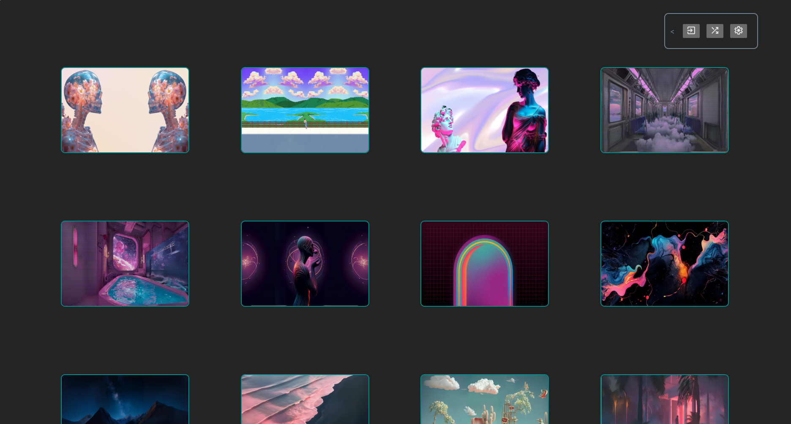

<div align="middle">
  
</div>

# WAL

:star: Star me up!

> :warning: **Work in Progress**: This project is currently under development. Some features may not be complete and may change in the future.

## What is WAL?

WAL is a cross-platform GUI and CLI tool for managing wallpapers.

It is agnostic of the desktop environment and can be used on Linux, Windows and macOS. (WIP)

## Requirements

Linux users should have `zenity` installed

## Usage

### GUI



simply run `wal` or click on the WAL icon

### CLI

run `wal --help` to see how it works

```
***************************************************
 WAL - wallpapers manager
***************************************************
-h, help: Display this help message
-v, version: Display the current version
-s, set: Set a wallpaper with the given path
-r, random: Set a random wallpaper
```


## License

WAL is distributed under the MIT license. See the LICENSE file for more information.
